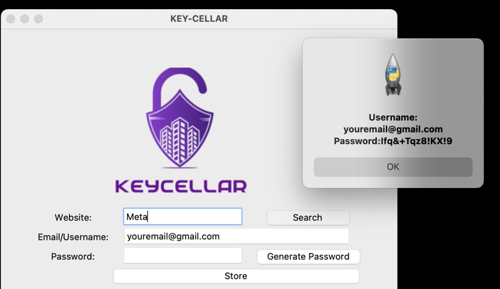

# KEYCELLAR
This project allows you to generate and store your passwords locally.


## Installation
1. Create a directory on your machine to house it. I find "CELLAR" to be a good fit!
```commandline
mkdir CELLAR
```
2. Look above and select "Code"
3. From here, copy HTTPS web URL
4. Return to your terminal and clone the repo.
```commandline
git clone https://github.com/LanoCodes/KEYCELLAR.git
```
5. Using your favorite IDE, open the CELLAR folder.
6. Navigate to main and run the program from there. You will need the tkinter, os.path, and pyperclip packages installed.

## Usage
- In the window that appears you will have three textboxes to enter information into:
  - Website
  - Email/Username
  - Password
- A gmail suffix is provided to you but feel free to remove it!
- Clicking "Generate Password" once will autogenerate a strong password.
  - It will automatically copy to your clipboard as well for easy pasting into a site
- After filling in each textbox with the necessary information, click "Store"
  - After clicking store be sure to confirm your choices
    - 
- Your data will be stored in a text file named "data.txt" in the same directory as this program.

As you save passwords over time, new entries will be appended to the file.